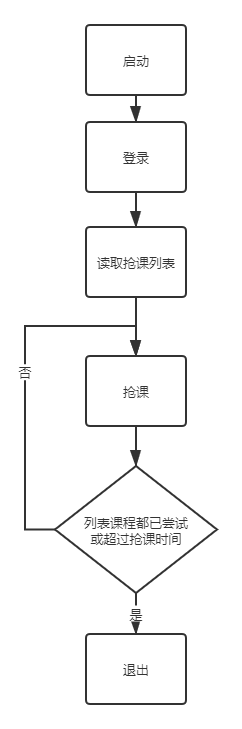
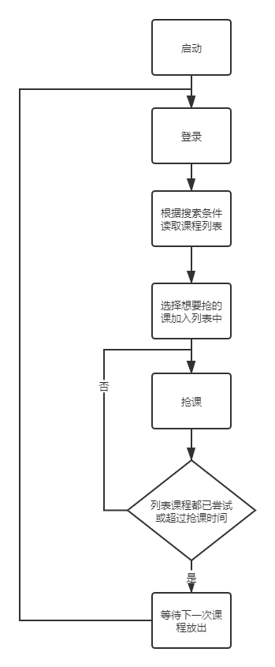

# SUSTech_Course_Graber

## Intro

这是为后 sustc 新 SUSTech 选课系统开发的 python 抢课脚本

## Requirment

python3

prettytable

requests

re

json

pyDes

可能还有其他要求，如有问题可以联系我

## Description

main.py 为基础版，course_search.py 可以搜索课程并构筑需要抢的课的列表，grabber_main.py 为手动抢课脚本，grabber_auto.py 可以实时搜索并调整课程列表并自动开始抢课

```bash
python grabber_auto.py
```

流程有明确提示，根据菜单输入指令即可完成抢课操作

### 软件逻辑





## Progress

手动版本能抢到课，自动版本刚完成还没有抢成功过

（不会吧，不会有人期待有人积分选课选上了还会退吧

## Contact

QQ: 820585042

欢迎提 issue，不过因为后 sustc 时代积分选课，开发动力不足，欢迎 contribute
